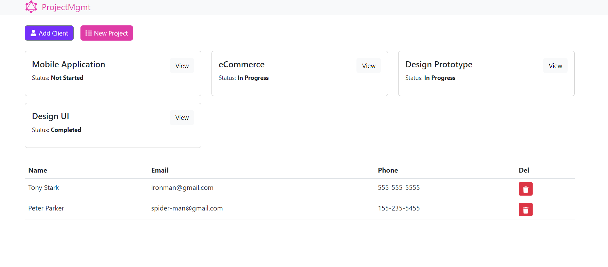
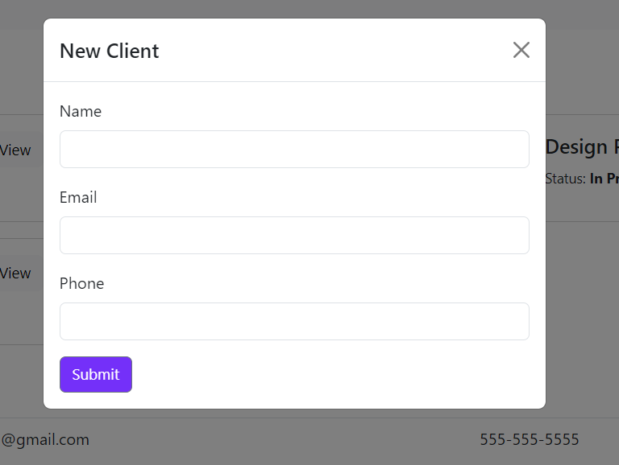
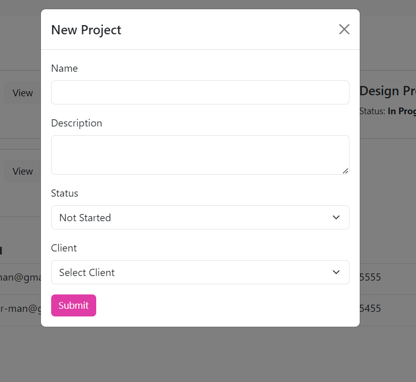
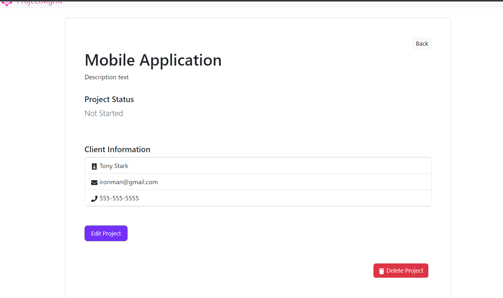
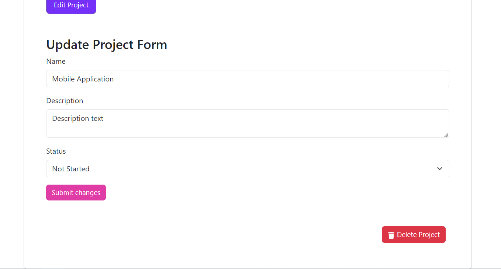

## Project Management Application

A responsive GraphQL MERN application that manages projects and clients for them.

The application implements all the CRUD operations with GraphQL, the manager can:

- add clients
- delete clients -> when a client is deleted, their projects are also deleted in cascade
- add projects
- delete projects
- edit projects

Other technologies/libraries used:

- GraphQL for communication between frontend and backend
- Typescript for React frontend
- Bootstrap for application design
- Apollo Client for working with graphql and caching
- React Router for page navigation
- Express-graphql for setting up the middleware that processes the queries with graphql
- colors js for console styling
- Mongoose ODM for working with MongoDB

### App presentation

#### Home page

The home page consist of a simple UI that displays all the users and all the projects. The manager can add/delete users or add projects from here. They can also view more details about the projects by going to project's individual page.

##### Add client

##### Add project

#### Project page

Page with details about the project. The manager can delete the project or edit it by clicking the edit button, which reveals an edit form auto-completed with the current project information that can be edited.

##### Edit project

### What I learned?

In this project I learned about implementing all the CRUD operations using GraphQL, from defining the schemas to defining the queries and how to communicate between the frontend and backend.

I also learned how to mutate the objects while also having a relation between 2 different objects.

### How to run ?

Frontend(client)

> npm run build

Backend(server)

> npm run dev
